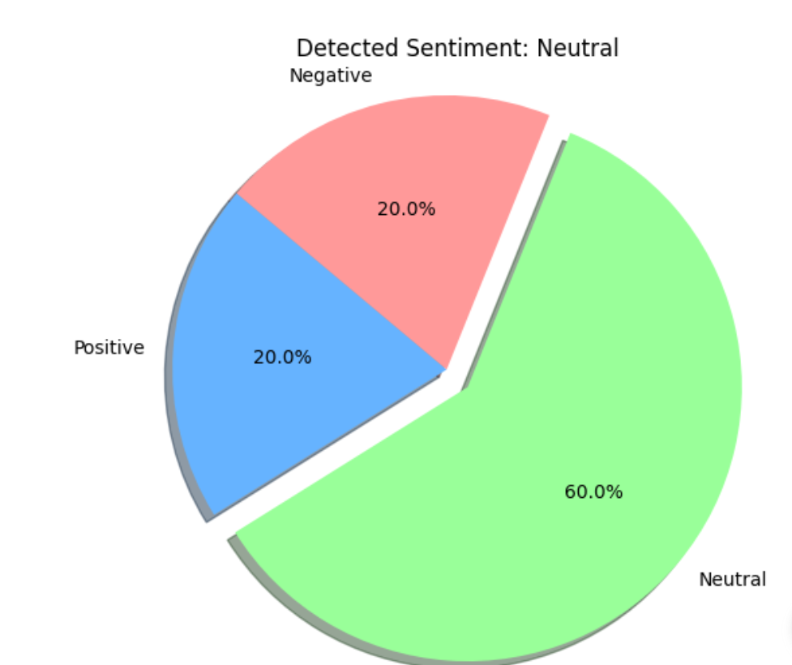
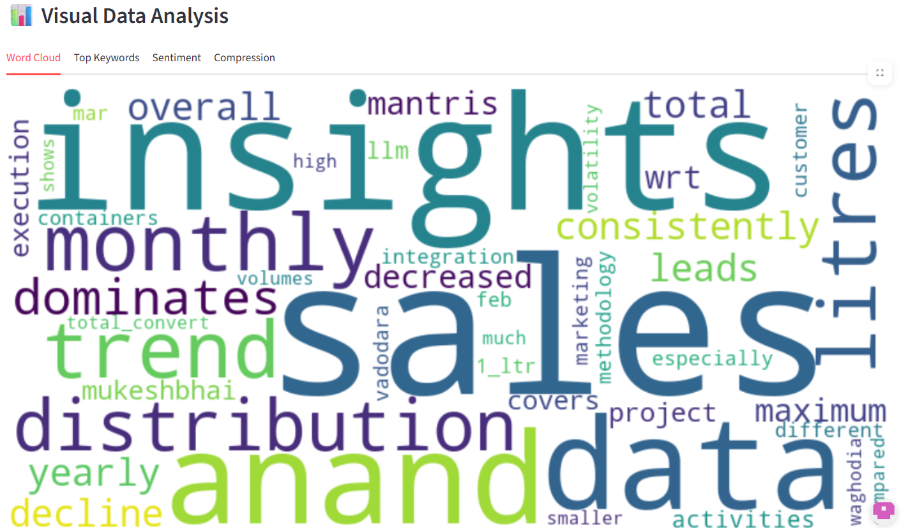

# InSightify: Smart Report Summarizer & Visualizer 📊

**InSightify** is an AI-powered web application designed to transform long, dense documents into concise summaries and visual insights. By leveraging state-of-the-art NLP models, InSightify helps users quickly grasp the essence of reports, papers, and articles through generated summaries, sentiment analysis, and interactive visualizations.
## 🚀 Live Demo
👉 https://insightify11.streamlit.app/

## 🚀 Key Features

*   **📄 Document Support**: Upload PDF or text files easily.
*   **📝 AI Summarization**: Get accurate, coherent abstracts of long texts using Transformer models.
*   **🧠 Sentiment Analysis**: Understand the overall tone (Positive/Negative/Neutral) of the document.
*   **📊 Interactive Visualizations**: Explore data through Sentiment Charts and Dynamic Word Clouds.
*   **📥 PDF Export**: Download a professional, fully formatted report containing all insights.
*   **⚡ Fast & Private**: Processed locally/server-side without external API dependencies (Phase 1).

## 📸 Screenshots

### 📊 Sentiment Analysis


### ☁️ Word Cloud


## 🛠️ Technology Stack

*   **Language**: Python 3.9+
*   **Frontend**: Streamlit
*   **AI Models**: Hugging Face Transformers (DistilBART, DistilBERT)
*   **Data Viz**: Plotly Express, WordCloud
*   **PDF Generation**: FPDF

## 📂 Project Structure

```bash
InSightify/
├── src/
│   ├── app.py          # Main application (Streamlit Entry Point)
│   ├── config.py       # Configuration settings
│   ├── modules/        # Core logic
│   │   ├── loader.py       # File ingestion
│   │   ├── preprocessor.py # Text cleaning
│   │   ├── model.py        # AI Inference
│   │   ├── visualizer.py   # Charts & WordClouds
│   │   └── reporter.py     # PDF Generation
│   └── utils/          # Helpers
├── data/               # Sample data for testing
├── docs/               # Documentation
├── tests/              # Unit tests
├── requirements.txt    # Python dependencies
└── README.md           # Project documentation
```

## ⚙️ Setup & Installation

1.  **Clone the Repository**
    ```bash
    git clone https://github.com/your-org/insightify.git
    cd insightify
    ```

2.  **Create a Virtual Environment**
    ```bash
    python -m venv venv
    # Windows
    venv\Scripts\activate
    # Mac/Linux
    source venv/bin/activate
    ```

3.  **Install Dependencies**
    ```bash
    pip install -r requirements.txt
    ```

4.  **Run the Application**
    ```bash
    streamlit run src/app.py
    ```

## 🤝 Contribution

This project follows a standard Git flow. Please create feature branches from `dev` and submit PRs for review.
